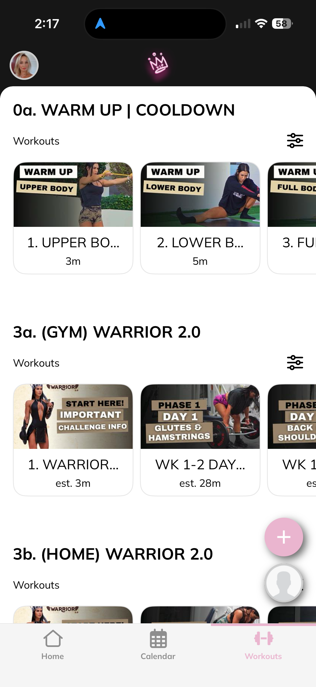
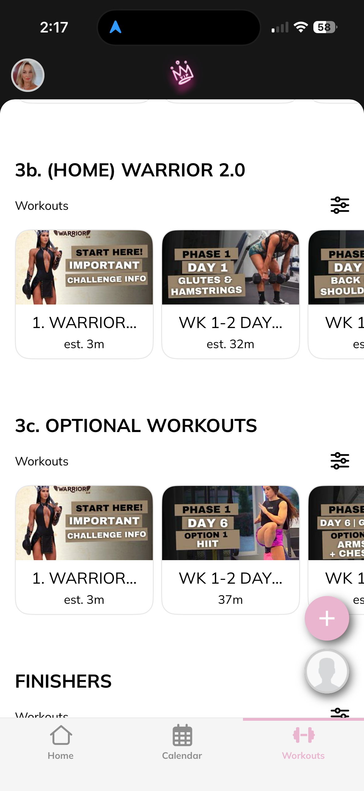
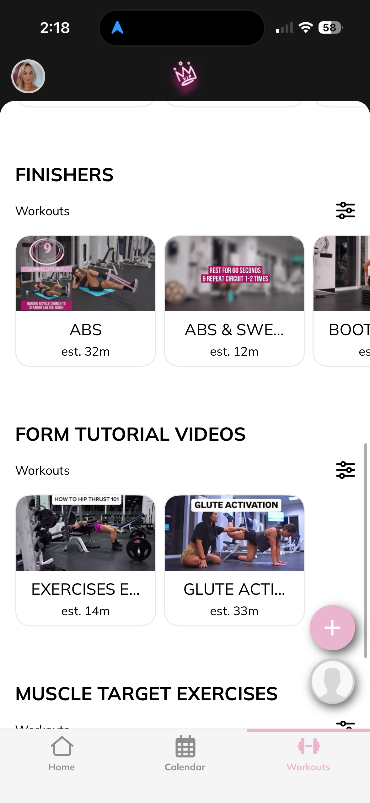
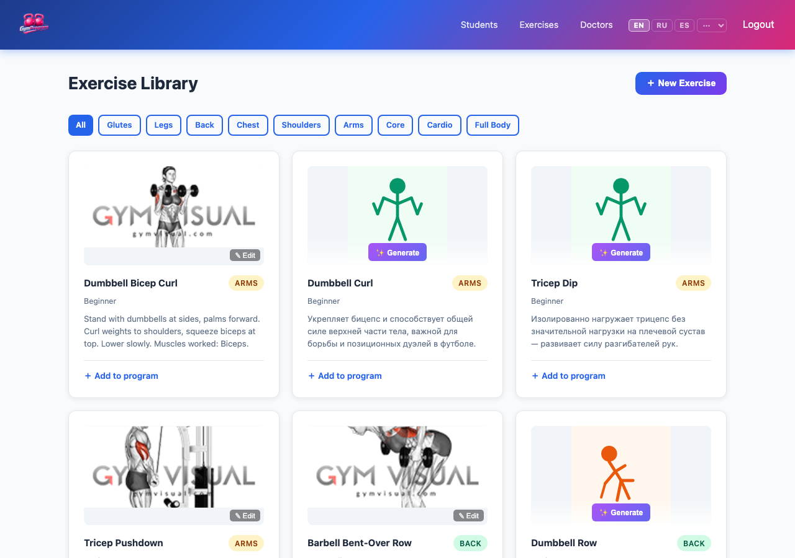
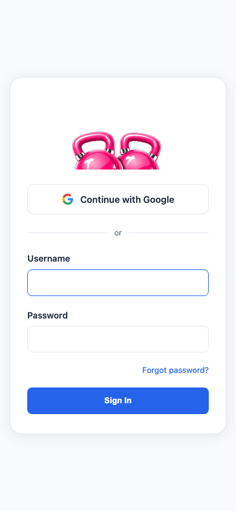

<div align="center">
  

  <h1>GYMprogrm</h1>

  <p><strong>AI-powered web app for personal trainers.</strong><br/>
  Manage clients · Generate programs · Analyze blood tests · Track progress · Installable on any phone.</p>

  
  
  
  
  

  **🌐 Live at [gymprogrm.org](https://gymprogrm.org)**

</div>

---

## Purpose

Personal trainers work with real people — each one with different goals, health conditions, and blood results. Keeping track of all of that across spreadsheets and messaging apps is slow and error-prone.

**GYMprogrm** centralizes everything in one place:

- The **trainer** gets a smart dashboard to manage clients, generate personalized programs using AI, and make sense of blood test data in seconds instead of hours.
- The **client** gets a clean mobile portal to view their program, log workouts, track progress, and pay — installable on their phone like a native app.

The AI doesn't replace the trainer's judgment — it does the heavy lifting of structuring information so the trainer can focus on the human side of coaching.

---

## Screenshots

### Trainer Dashboard — Student List


### Student Profile — Blood Test Analysis


### AI Program Generation


### Program Detail — Workout Days & Nutrition Plan


### Exercise Library


### Client Portal — My Program


> **To add screenshots:** take a screenshot of each page, save it to `docs/screenshots/` with the matching filename, then push to GitHub.

---

## Features

### For the trainer

**Client management**
- Create and edit student profiles (goals, health issues, measurements, contact info, photo)
- Public intake form — clients fill it in themselves via a shareable link, trainer reviews and accepts
- Invite system — send a unique registration link to a client by email
- Billing tracking per student — plan, status (paid / pending / overdue), payment method, start date, next renewal

**AI program generation (Claude Sonnet 4.6)**
- Input: student profile + goals + health issues + training days + blood test (optional) + body photo (optional)
- Output: full multi-day workout program with exercise names (EN + RU), sets/reps, and reasoning per exercise
- Separate nutrition plan — daily calories, macros, 4 meals with foods and portions, fasting recommendation, supplements
- Post-generation deduplication — no exercise appears twice across days
- Exactly 6 exercises per day (5 muscle-group + 1 core finisher)
- Trainer reviews each AI suggestion and confirms or skips before it goes live

**Blood test analysis**
- Upload PDF or image of any blood test
- Claude reads every abnormal marker, identifies deficiencies, flags urgent values
- Produces tailored exercise and nutrition recommendations based on actual lab results
- Key findings auto-written to the student's health issues field

**Exercise library**
- Filter by muscle group (glutes, legs, back, chest, shoulders, arms, core, cardio)
- AI-generated exercise illustrations (DALL-E 3) with posture tips (Claude Haiku)
- Add any exercise to a specific program day in one click

**Trainer payment settings**
- Set global PayPal / Venmo / Zelle handles that apply to all students by default
- Override per-student if needed

**Trainer recommendations**
- Write personal notes/recommendations for each client
- Client sees them on their portal once confirmed

**Doctor / specialist connect**
- Add doctors with photo, specialty, bio, and booking link
- Shown on each client's portal for easy referral

---

### For the client (student portal)

**Installable on any phone (PWA)**
- On iPhone: Safari → Share → "Add to Home Screen" — opens fullscreen like a native app
- On Android: Chrome → "Install App" — same experience
- Service worker caches pages for offline access

**Mobile-first navigation**
- Bottom tab bar: Home · Program · History · Tips · Billing
- No hamburger menu — every section one tap away

**Workouts**
- View active program by day with exercise photos and technique tips
- Log each session — sets, reps, weight per exercise with pre-filled previous values
- Built-in rest timer per exercise
- Full workout history with per-exercise breakdown

**Body measurements**
- Log weight, body fat %, and measurements (waist, hips, chest, arms, legs) over time

**Billing page**
- View subscription plan, status, and next renewal date
- "Pay via PayPal / Venmo / Zelle" button opens the trainer's payment link directly

**Multilingual**
- Interface available in: English · Russian · Spanish · French · German · Italian · Portuguese · Chinese · Arabic · Japanese
- Language switcher in the top bar, persists across pages
- Program and exercise names shown in the student's chosen language

---

## Tech stack

| Layer | Technology |
|---|---|
| Backend | Django 5.2 + Python 3.11 |
| Database | PostgreSQL (production) / SQLite (dev) |
| AI — programs & analysis | Anthropic Claude Sonnet 4.6 |
| AI — posture tips & text | Anthropic Claude Haiku 4.5 |
| AI — exercise illustrations | OpenAI DALL-E 3 |
| Media storage | Cloudinary |
| Static files | WhiteNoise |
| PWA | Web App Manifest + Service Worker |
| Server | Gunicorn (gthread, 4 threads, 300 s timeout) |
| Deployment | Render (auto-deploy from GitHub) |

---

## Project structure

```
GYMprogrm/
├── students/          # Profiles, intake, invite system, blood analysis, billing
├── programs/          # Programs, exercise library, AI generation
├── progress/          # Workout logs per session
├── measurements/      # Body measurements over time
├── gymprogrm/         # Settings, URLs, WSGI
├── templates/         # All HTML (trainer + client portal)
│   ├── students/      # Student portal pages (dashboard, program, history, billing, recommendations)
│   ├── programs/      # Program detail, exercise library
│   └── sw.js          # Service worker (PWA)
├── static/
│   ├── css/base.css   # Global styles + bottom nav + responsive
│   ├── images/        # Logo, exercise photos, student photos
│   └── manifest.json  # PWA manifest
├── locale/            # Translation files (EN/RU/ES/FR/DE/IT/PT/ZH/AR/JA)
├── Procfile           # Gunicorn start command
└── render.yaml        # Render deploy config (web + PostgreSQL)
```

---

## Data model

```
Student
  ├── WorkoutProgram
  │     └── ProgramDay
  │           └── ProgramExercise ── ExerciseLibrary
  ├── WorkoutLog
  │     └── ExerciseLog
  └── BodyMeasurement

TrainerPaymentSettings   # global PayPal / Venmo / Zelle handles
Doctor                   # specialist referrals shown on portal
```

---

## Local setup

```bash
git clone https://github.com/Liliyalexx/GYMprogrm.git
cd GYMprogrm
python -m venv venv && source venv/bin/activate
pip install -r requirements.txt

# Create .env (see Environment variables below)
python manage.py migrate
python manage.py createsuperuser
python manage.py runserver
```

Visit `http://localhost:8000` — log in as the superuser (trainer account).

Students access their portal at `http://localhost:8000/portal/`.

---

## Environment variables

```env
SECRET_KEY=your-django-secret-key
DEBUG=True
DATABASE_URL=                       # leave blank → uses SQLite locally
ALLOWED_HOSTS=localhost,127.0.0.1
CSRF_TRUSTED_ORIGINS=               # https://gymprogrm.org

ANTHROPIC_API_KEY=                  # required — program generation & blood analysis
OPENAI_API_KEY=                     # required — exercise illustrations (DALL-E 3)

CLOUDINARY_URL=                     # optional — cloud media storage for photos
RESEND_API_KEY=                     # optional — transactional email (invites)
```

---

## Deployment (Render)

The app is deployed at **[gymprogrm.org](https://gymprogrm.org)** on Render.

Every push to `main` triggers an automatic deploy:

```
✓ pip install -r requirements.txt
✓ python manage.py collectstatic --noinput
✓ python manage.py migrate --noinput
✓ gunicorn gymprogrm.wsgi --worker-class gthread --threads 4 --timeout 300
```

`render.yaml` in the repo root defines the web service + PostgreSQL database. To deploy your own copy:

1. Fork this repo
2. Go to **Render → New → Blueprint** and connect your fork
3. Set `ANTHROPIC_API_KEY`, `OPENAI_API_KEY`, `CLOUDINARY_URL`, `RESEND_API_KEY` in the Render environment variables
4. Deploy — database is provisioned automatically

---

## Installing as a mobile app

Students can install the portal as a native-feeling app — no app store needed.

**iPhone / iOS:**
1. Open `https://gymprogrm.org/portal/` in **Safari**
2. Tap the **Share** button (box with arrow)
3. Tap **"Add to Home Screen"**
4. Tap **Add** — the GYMprogrm icon appears on your home screen
5. Open it — launches fullscreen, no browser bar

**Android:**
1. Open `https://gymprogrm.org/portal/` in **Chrome**
2. Tap the **⋮ menu** → **"Add to Home Screen"** or **"Install App"**
3. Tap **Install**

---

## License

Private project. All rights reserved.
